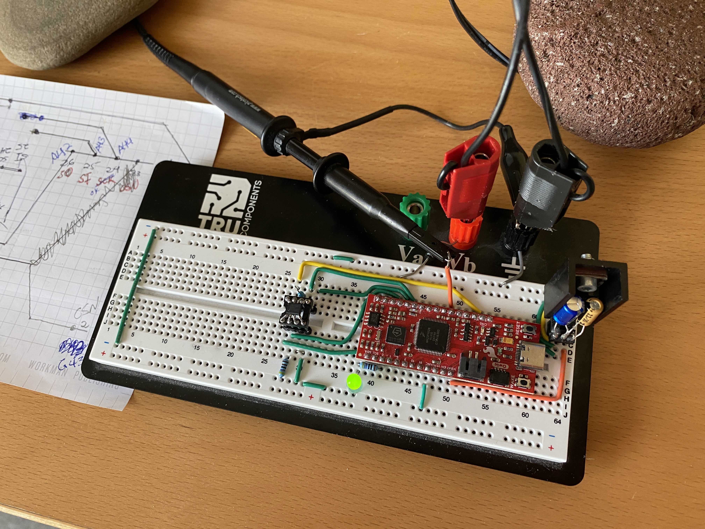

Osek_pi_crunch_riscv
==================

<p align="center">
    <a href="https://github.com/ckormanyos/Osek_pi_crunch_riscv/actions">
        </a>
</p>

This repository uses an OSEK-like OS on bare-metal RISC-V FE310 to calculate $\pi$
with a spigot algorithm.

Osek_pi_crunch_riscv is a fascinating, educational and fun project
that computes a up to $100,001$ decimal digits of $\pi$
on a bare-metal RISC-V FE310 system.

The board is driven in bottom-to-top, hand-written, bare-metal mode.
The software upper layers including algorithms and SRAM communication
are chip-independent and portable.

The backbone real-time operating system is taken directly
from the OSEK-like OS for RISC-V implemented in
[Chalandi/OSEK_RISC-V_SiFive_FE310_SoC](https://github.com/Chalandi/OSEK_RISC-V_SiFive_FE310_SoC)

# Mathematical details

Spigot-type algorithms are known for various mathematical constants
including logarithms and $\pi$.

The basic spigot algorithm for computing digits of $\pi$
in base-10 is given by
(Eq. 6.1, Sect. 6.1, page 78 of Arndt and Haenel [2]):

$$\dfrac{1}{3}\Biggl(2 + \dfrac{2}{5}\Biggl( 2 + \dfrac{3}{7}\Biggl(2 + \ldots \Biggr)\Biggr)\Biggr)$$# Building the Application

In the code, this equation is primarily implemented in the
`calculate()` method of the `pi_spigot` template class
which resides in namespace `math::constants`.

## Further Information

  - The original publication of the description of the spigot algorithm can be found in [1].
  - The expression of this algorithm (as used in this repository) has been further influenced by descriptions in [2].
  - The pi_spigot implementation in C++ code in this repository has been inspired by Section 10.8 of [3].
  - A PC-only realization of the pi_spigot algorithm can be found in [imahjoub/pi_spigot](https://github.com/imahjoub/pi_spigot)

# Software Details

As mentioned above,
to compute $\pi$, we use a (slow) quadratic pi-spigot algorithm
of order $N^2$ in this project. The spigot calculation
(having quadratic order) is slower than other well-known algorithms
such as AGM or fast series.

The required memory grows linearly with the digit count.
Approximately 1.4 Mbyte RAM are needed for the full $10^{5}$
decimal-digit calculation. Since this is significantly more RAM
than is available on-chip, a slow external serial SPI SRAM is used
for storage.

GNU/GCC `riscv32-unknown-elf` is used for target system
development on `*nix`. The build system is based on
Standard GNUmake/shell-script.

## Build with GNUmake on `*nix`

Build on `*nix*` is easy using an installed `gcc-arm-none-eabi`

```sh
cd Osek_pi_crunch_riscv
./Build.sh
```

The build results including ELF-file, HEX-mask, MAP-file
can be found in the `Output` directory following the GNUmake build.

If `riscv32-unknown-elf` is not present, then it can be obtained (if needed)
with `wget`, e.g. from
[Embecosm](https://www.embecosm.com/resources/tool-chain-downloads/#riscv-stable).
When doing this, remember also to add the directory of the extracted toolchain locally
to `PATH` for the build.

```sh
wget --no-check-certificate https://buildbot.embecosm.com/job/riscv32-gcc-ubuntu2004/169/artifact/riscv32-embecosm-gcc-ubuntu2004-20230507.tar.gz
tar -xvzf riscv32-embecosm-gcc-ubuntu2004-20230507.tar.gz
PATH=./riscv32-embecosm-gcc-ubuntu2004-20230507/bin:$PATH
```

# Prototype Project

This repo features a fully-worked-out prototype example project.
The prototype runs on a RISC-V FE310 controller fitted on the
SparkFun _Red_ _Thing_ RISC-V FE310 Board.

The $\pi$-spigot calculation runs continuously and successively
in the low-priority idle task (`Idle`). Upon successful calculation completion,
the pin on `port0.19` is toggled.

Simultaneously task `T1` exercises a perpetual, simple blinky show
featuring a self-fitted LED on `port0.0` toggling at 1/2 Hz.
This provides clear visual measure of both system-OK as well as
numerical correctness of the most-recently finished spigot calculation.

## Hardware Setup

The hardware setup is pictured in the image below.



The blinky LED-toggle show is carried out with a self-fitted LED
on `port0.0`.

Consider, in particular, the on-board, blue user-LED found default-fitted
on `port0.5`. As is usual for Arduino-compatible pinouts,
this port pin is needed for the SPI serial-clock signal (SCK).
But this should be routed to the SCK signal of the external SRAM.
So the blue LED on `port0.5` cannot be used for the blinky show on the user-LED.

For this reason, a self-fitted, $7{mA}$, green LED
with a $470{\Omega}$ current-limiting resistor has been
placed on the breadboard on `port0.0`. This self-fitted,
green LED on `port0.0` is used for the blinky show.

## Breadboard Layout

The breadboard layout (without the microcontroller board) is shown below.

# References


[1] S. Rabinowitz and S. Wagon:
_A_ _Spigot_ _Algorithm_ _for_ _the_ _Digits_ _of_ _Pi_,
American Mathematical Monthly 102: 195-203, 1995

[2] J. Arndt and C. Haenel:
$\pi$ _Unleashed_ (Springer Verlag, Heidelberg, 2001)

[3] C.M. Kormanyos: _Real-Time_ _C++:_
_Efficient_ _Object-Oriented_
_and_ _Template_ _Microcontroller_ _Programming_, _4th_ _Edition_
(Springer Verlag, Heidelberg, 2021). ISBN 9783662629956.
